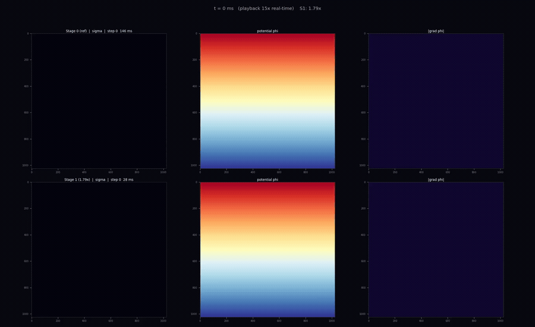

# CBRAM Filament-Growth Simulation — Profiling & Optimization

A from-scratch simulation of a **conductive-bridge RAM (CBRAM)** cell forming —
the physical event that stores a bit, where a metallic filament grows across a
dielectric until it bridges two electrodes — used as a case study in **HW/SW
co-design**: profile a memory-bound stencil kernel, find the *binding* hardware
constraint, and optimize against it.

<p align="center">
  
</p>

<p align="center">
  <em>A real-time race at N=1024. <b>Top:</b> the unoptimized array-of-structs baseline.
  <b>Bottom:</b> the struct-of-arrays version. Both are <b>bit-identical</b> — same growth
  sequence, same final filament — so it's a fair race. The on-screen gap <b>is</b> the speed-up:
  SoA bridges the gap while the baseline is still only halfway.</em>
</p>

## The model

We use the **Dielectric Breakdown Model (DBM)** on an *N×N* grid. Each *growth step*:

1. **warm-starts a Jacobi solve** of the Laplace potential `∇²V = 0`, with the
   existing filament pinned to the cathode (`V = 0`) and the anode held at `V_app`, then
2. **adds one filament-adjacent cell**, chosen at random with probability ∝ `V^η` (η = 3).

The field concentrates at the filament tip, so growth is self-reinforcing and a
narrow, branched filament emerges — the morphology CBRAM actually exhibits. The run
is dominated by step 1: 30 double-buffered stencil sweeps over the whole grid, every
step — a **low-arithmetic-intensity, memory-bound stencil**, exactly where data
layout and cache locality decide performance.

## Results

Single core, Intel Xeon E5-2630 v3, *N = 6144*, 80 growth steps (working set ≈ 302 MB ≈ 19× the L3):

| Stage | Layout | Time | vs. baseline | IPC | L1-miss | LLC-misses |
|-------|--------|-----:|:------------:|----:|--------:|-----------:|
| 0 | Array-of-Structs (baseline) | 358.4 s | 1.00× | 1.84 | 18.9 % | 2.84 B |
| 1 | **Struct-of-Arrays** | **243.6 s** | **1.47× faster** | 2.44 | 7.3 % | 0.44 B |
| 2 | SoA + temporal blocking | 281.5 s | 1.27× | 2.88 | 4.3 % | 0.09 B |

- **Stage 1 (SoA)** is the clean win: a pure data-layout change that lifts cache-line
  utilization from ~50 % to ~100 % and deletes a per-sweep buffer copy — **1.47×
  faster, bit-identical**, no math touched.
- **Stage 2 (time-skewing)** is the instructive failure: it has the *best memory
  behaviour of any stage* (lowest L1-miss, 32× fewer LLC misses than the baseline,
  highest IPC) and is **still slower than SoA** — the redundant halo recomputation
  added +40 % instructions, and on a single core the memory traffic it saved was
  never the binding constraint (we ran at <1 % of peak DRAM bandwidth; the limiter
  was *latency*). An optimization only wins when the resource it saves is the one
  actually limiting you, *and* the cost paid elsewhere is smaller than the saving.

The full analysis is in [`report/cbram_report.pdf`](report/cbram_report.typ) (regenerate with `./make_submission.sh`).

## Build & run

```bash
./build.sh                          # compiles cbram_stage0/1/2 into build/
./build/cbram_stage1 6144 -s 80     # one run: N=6144, 80 growth steps

# full pipeline: build + bit-identical correctness gate + perf stat + flame graphs
./run.sh 6144 80
```

Correctness is enforced as a gate — every stage must produce a `V_final` that is
**bit-identical** to the baseline (`cmp build/V_final_stage1.bin build/V_final_stage0.bin`),
so an optimization can never "cheat" by changing the numerics.

## Repository layout

| Path | What |
|------|------|
| `dbm_stage0/1/2.cpp` | the three implementations (AoS → SoA → time-skewing) |
| `physics_dbm.h`, `io.{h,cpp}` | shared simulation core and I/O |
| `build.sh`, `run.sh`, `CMakeLists.txt` | compile / run / profile |
| `report/cbram_report.typ` | the 3-page report (Typst source) |
| `results/` | perf evidence: `stage*.perf`, flame-graph SVGs, derived metrics |
| `render_comparison_video.py` | renders the race video above |

## Authors

Matan Cohen · Yuval Kogan — HW/SW Co-Design, HW1.
